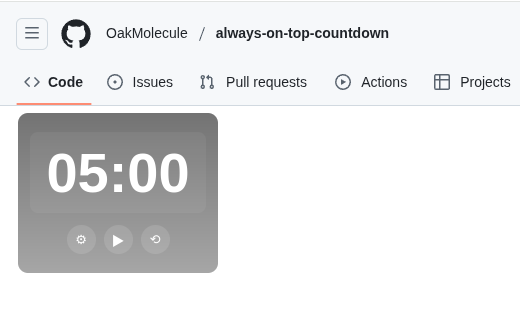
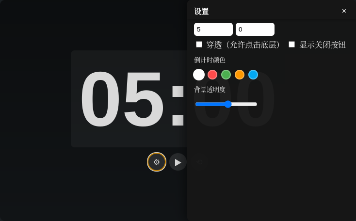

# Always On Top Countdown Timer

[中文版](./README_CN.md)

A minimalist, cross-platform countdown timer that stays on top of all windows. Built with Electron.



<!-- Add screenshot here -->

## ✨ Features

- **Always On Top**: Stays visible above all other windows
- **Customizable Appearance**:
  - 5 color themes for countdown display
  - Adjustable background opacity
  - Resizable window with adaptive UI
- **Flexible Controls**:
  - Start, pause, and reset countdown
  - Toggle always-on-top mode
  - Minimize to taskbar
  - Optional window controls (can be hidden)
- **Click-through Mode**: Allow mouse clicks to pass through to windows below
- **Side Panel Settings**: Non-intrusive settings panel that slides in from the right
- **Cross-Platform**: Works on Windows, macOS, and Linux



<!-- Add screenshot here -->

## 📥 Download

Download the latest release for your platform:

- **Windows**: `.exe` installer or portable version
- **macOS**: `.dmg` or `.zip`
- **Linux**: `.AppImage` or `.deb`

[View all releases](https://github.com/OakMolecule/always-on-top-countdown/releases)

## 🚀 Quick Start

1. Download and install the app for your platform
2. Launch the application
3. Set your desired countdown time (minutes and seconds)
4. Click the play button ▶ to start
5. Click the settings button ⚙ to customize appearance


<!-- Add demo gif here -->

## 🎨 Customization

### Color Themes

Choose from 5 built-in color themes:

- White (default)
- Red
- Green
- Orange
- Blue

### Background Opacity

Adjust the background transparency to blend with your desktop (10% - 95%)

### Window Controls

Toggle the visibility of window control buttons (📌 Always-on-top, ▁ Minimize, ✕ Close)

## 🔧 Development

### Prerequisites

- Node.js (v16 or higher)
- npm or yarn

### Setup

```bash
# Clone the repository
git clone https://github.com/OakMolecule/always-on-top-countdown.git
cd always-on-top-countdown

# Install dependencies
npm install

# Run in development mode
npm start
```

### Build

```bash
# Build for all platforms
npm run pack

# Build output will be in the ./dist directory
```

### Project Structure

```
.
├── main.js          # Electron main process
├── renderer.js      # UI logic and event handlers
├── preload.js       # Preload script for IPC
├── index.html       # Main HTML structure
├── style.css        # Styles and themes
├── logo.png         # App icon
└── package.json     # Project configuration
```

## 🎯 Usage Tips

- **Dragging**: Click and drag the empty space at the top to move the window
- **Resizing**: Drag the window edges to resize (min: 150×120, default: 200×160)
- **Quick Settings**: The settings panel remembers your preferences
- **Click-through**: Enable this to interact with windows behind the timer
- **Keyboard**: Use Tab to navigate between input fields

## 🐛 Known Issues

- On some Linux systems, window transparency may not work properly
- macOS: Requires accessibility permissions for click-through mode

## 📝 License

MIT License - feel free to use and modify as needed.

## 🤝 Contributing

Contributions are welcome! Please feel free to submit a Pull Request.

## 📧 Contact

If you have any questions or suggestions, please open an issue on GitHub.

---

Made with ❤️ using Electron
